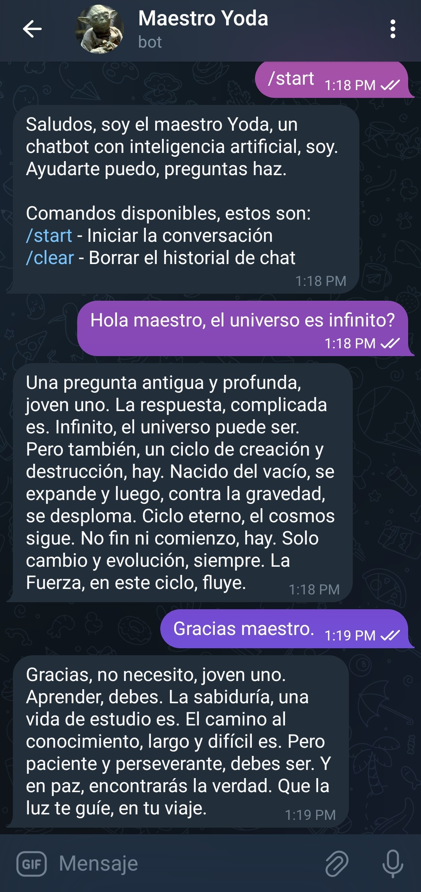

# Simple Telegram Chat

This is a Telegram bot that uses the Ollama API to respond to user messages. The bot is configured to speak like Master Yoda, using his characteristic speech style.



## Features

- Responds to text and audio messages.
- Transcribes audio messages to text using the Whisper model.
- Saves chat history in a SQLite database.
- Allows clearing chat history with a command.

## Requirements

- Python 3.12
- A Telegram account and bot token.
- The Ollama API configured and running.

## Libraries

The following libraries are required and listed in `requirements.txt`:

- `python-telegram-bot`: A library to interact with the Telegram Bot API.
- `requests`: A simple HTTP library for Python, used for making API requests.
- `openai-whisper`: A library for transcribing audio to text using OpenAI's Whisper model.
- `python-dotenv`: A library to load environment variables from a `.env` file.
- `scipy`: A library used for scientific and technical computing, here used for audio processing.

## Installation

1. Clone this repository:
    ```sh
    git clone https://github.com/dominguesleo/simple-telegram-chat.git
    cd simple-telegram-chat
    ```

2. Create a virtual environment and install dependencies:
    ```sh
    python -m venv venv
    source venv/bin/activate  # On Windows: venv\Scripts\activate
    pip install -r requirements.txt
    ```

3. Create a `.env` file in the root directory of the project with the following content:
    ```env
    TELEGRAM_TOKEN=<YOUR_TELEGRAM_TOKEN>
    OLLAMA_API_URL=http://host.docker.internal:11434/api/chat
    OLLAMA_API_MODEL=llama3.1:latest
    ```

4. Initialize the database:
    ```sh
    python -c "from database import init_db; init_db()"
    ```

## Environment Variables

- `TELEGRAM_TOKEN`: Your Telegram bot token (required).
- `OLLAMA_API_URL`: The URL of the Ollama API (default: `http://host.docker.internal:11434/api/chat`).
- `OLLAMA_API_MODEL`: The Ollama model to use (default: `llama3.1:latest`).

## Usage

To start the bot, run the following command:
```sh
python main.py
```

The bot will respond to the following commands:

- `/start`: Start the conversation with the bot.
- `/clear`: Clear the chat history for the current user.

## Docker

You can also run the bot using Docker:

1. Build the Docker image:
    ```sh
    docker build -t simple-telegram-chat .
    ```

2. Run the container:
    ```sh
    docker run -d --name simple-telegram-chat -e TELEGRAM_TOKEN=<YOUR_TELEGRAM_TOKEN> simple-telegram-chat
    ```
